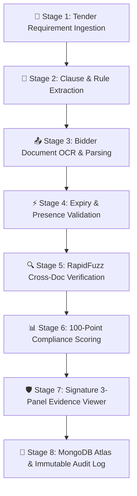

# BidSure AI 🛡️
### AI-Powered Integrated Bid Compliance Verification Platform for GeM Procurement
> **SIH Problem Statement**: SIH26100 — Procurement Compliance & Cross-Document Intelligence  
> **Core Architecture**: Human-in-the-Loop Decision-Support System for Government Procurement Officers  
> 📖 **Full Workflow & Architecture Map**: See [WORKFLOW.md](WORKFLOW.md)

---

## 📌 Executive Pitch & Problem Statement

**BidSure AI** is an enterprise-grade procurement compliance intelligence platform built for the **Government e-Marketplace (GeM)** environment. It directly solves **Smart India Hackathon Problem Statement SIH26100** by automating the extraction, cross-document verification, entity similarity checking, and compliance auditing of bidder documentation against mandatory tender clauses.

> ⚠️ **CRITICAL ARCHITECTURAL GUARDRAIL**:  
> **BidSure AI is strictly a Decision-Support System.** It **NEVER** automatically qualifies, disqualifies, or rejects any bidder. All AI recommendations, extracted bounding box coordinates, string similarity scores, and compliance statuses are presented to the **Procurement Officer**, who retains full legal and administrative authority for final decisions.

---

## 🔄 End-to-End System Pipeline & Workflow



1. **Stage 1: Tender Ingestion**: Procurement officer creates/ingests tender specifications and mandatory submission rules.
2. **Stage 2: Requirement Extraction**: Normalizes requirements (GST, MSME, OEM, Validity, Signatory Declaration) with page markers.
3. **Stage 3: Bidder Document Parsing**: Evaluates submitted PDF bid packages, extracts metadata, and computes SHA-256 hashes for cryptographic integrity.
4. **Stage 4: Expiry & Presence Validation**: Automatically checks if mandatory certificates are present and valid on the bid deadline date.
5. **Stage 5: RapidFuzz Cross-Doc Verification**: Performs fuzzy string matching across GST, MSME, and Signatory documents to detect entity name discrepancies (e.g., *Bharat Industrial Systems Pvt Ltd* vs *Bharat Industries Systems Private Limited* at 71% match).
6. **Stage 6: 100-Point Compliance Scoring**: Calculates transparent category scores (`LOW`, `MEDIUM`, `HIGH` risk tiers).
7. **Stage 7: Signature 3-Panel Evidence Viewer**: Displays document traceability, interactive high-resolution canvas with yellow highlighted OCR bounding boxes, and an Officer Action Center.
8. **Stage 8: MongoDB Atlas & Immutable Audit Log**: Saves all officer decisions, review notes, and audit events live to MongoDB Atlas (`Bid-Sure-AI` database).

---

## 📂 Codebase Architecture & File Responsibility Map

For full file-by-file component tasks and complete architectural details, consult [WORKFLOW.md](WORKFLOW.md).

```
BidSure-AI/
├── WORKFLOW.md                    # Detailed workflow diagram, component tasks & file responsibilities
├── README.md                      # Comprehensive platform guide & pitch
├── package.json                   # Workspace launcher (dev, dev:backend, dev:frontend, seed)
├── backend/                       # Express REST API Server & MongoDB Atlas Integration
│   ├── .env                       # MongoDB Atlas URI & environment secrets (git-ignored)
│   ├── package.json               # Backend dependencies & node scripts
│   └── src/
│       ├── server.js              # Express API entrypoint & EADDRINUSE port error handler
│       ├── config/db.js           # MongoDB Atlas Mongoose connection handler
│       ├── seed/seed.js           # SIH procurement database seeder script
│       ├── models/                # Mongoose Database Schemas (User, Tender, Bidder, Finding, AuditLog, AdapterStatus)
│       └── routes/                # Express REST API Routes (auth, tenders, bidders, findings, audit, adapters, stats)
└── frontend/                      # React 19 High-Effect Web Application
    ├── vite.config.js             # Vite build & dev server configuration
    ├── package.json               # Frontend dependencies (React Router DOM v7, Recharts, Lucide)
    └── src/
        ├── main.jsx               # React DOM root renderer
        ├── App.jsx                # Router declaration & protected route guards
        ├── index.css              # Ultra-professional dark glassmorphism design system & CSS tokens
        ├── api/client.js          # Unified REST API client with live MongoDB Atlas connection & fallback
        ├── store/authStore.js     # Zustand authentication state manager & role switcher
        ├── components/            # Layout & Reusable UI Components (layout.jsx, shared.jsx)
        └── pages/                 # Full Application Pages (Dashboard, Tenders, Bidders, Compliance, Findings, Misc, Login)
```

---

## 📊 100-Point Explainable Scoring System

| Category | Points | Evaluation Rationale |
| :--- | :---: | :--- |
| **Mandatory Documents** | **25** | Deducts 10 pts per missing mandatory document (GST, MSME, OEM, Declaration). |
| **Certificate Validity** | **20** | Awarded if all submitted certificates are valid on bid submission date. 0 pts if expired. |
| **Entity Consistency** | **25** | Deductions based on RapidFuzz similarity matching (<90% = -3 pts, <75% = -13 pts, <60% = -17 pts). |
| **Tender Requirements** | **20** | Points earned for fulfilling custom technical tender clauses. |
| **Verification Checks** | **10** | Points earned for external Verification Gateway adapter confirmations. |
| **TOTAL** | **100** | **Risk Tiers: LOW (90-100), MEDIUM (65-89), HIGH (<65)** |

---

## 💻 Local Installation & Setup Guide

### 1. Prerequisites
- Node.js `v18.0.0` or higher
- npm `v9.0.0` or higher
- MongoDB Atlas cluster URI or local MongoDB instance

### 2. Installation Steps

1. **Clone the Repository**
   ```bash
   git clone https://github.com/CodewithHammad08/BidSure-AI.git
   cd BidSure-AI
   ```

2. **Configure Backend Environment (`backend/.env`)**
   Create a `.env` file in the `backend/` folder:
   ```env
   PORT=5000
   MONGODB_URI=mongodb+srv://<username>:<password>@cluster0.peqg6tf.mongodb.net/Bid-Sure-AI?retryWrites=true&w=majority&appName=Cluster0
   JWT_SECRET=bidsure_secret_key_sih_2026
   ```

3. **Install Dependencies**
   ```bash
   npm run install:all
   ```

4. **Seed Database & Start Application**
   ```bash
   npm run dev
   ```

- **Frontend Application**: `http://localhost:5173`
- **Backend REST API**: `http://localhost:5000/api`

---

## 📄 SIH Declaration & License

This platform was constructed for **Smart India Hackathon (SIH26100)** as an AI-powered integrated bid compliance verification prototype. All mock data and adapter endpoints are simulated for demonstration purposes. Production deployment requires authorized API credentials from government authorities (GSTN, Udyam, MCA21, ITD).