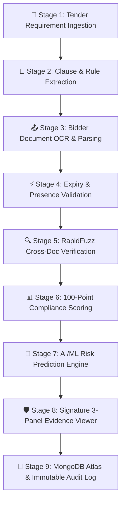

# BidSure AI — Platform Workflow & System Architecture 🛡️
> **SIH Problem Statement**: SIH26100 — Procurement Compliance & Cross-Document Intelligence  
> **Core Guardrail**: Human-in-the-Loop Decision-Support System for Government Procurement Officers

---

## 🔄 End-to-End System Pipeline & Operational Flow



### Stage-by-Stage Analytical Pipeline:

1. **Stage 1: Tender Ingestion**:
   - Procurement Officer inputs or selects tender parameters (Title, Reference Number, Department, Estimated Value, Submission Deadline).
   - Saved directly to MongoDB Atlas `tenders` collection via `POST /api/tenders`.

2. **Stage 2: Requirement Clause Extraction**:
   - Normalizes mandatory submission requirements into structured rules:
     - `REQ-001`: GST Registration Certificate (Mandatory, Page 12)
     - `REQ-002`: MSME / Udyam Certificate (Mandatory, Page 14)
     - `REQ-003`: OEM Authorization Letter (Mandatory, Page 15)
     - `REQ-004`: Certificate Expiry Validity (Mandatory, Page 13)
     - `REQ-005`: Authorized Signatory Declaration (Mandatory, Page 16)

3. **Stage 3: Bidder Document Parsing & Hashing**:
   - Parses multi-page PDF packages submitted by bidding entities.
   - Computes SHA-256 cryptographic hashes for document authenticity and tamper detection.
   - Records average OCR confidence per document (`ocr_confidence_avg`) passed to the AI/ML engine.

4. **Stage 4: Expiry & Presence Validation**:
   - Evaluates certificate expiry dates against bid submission deadlines (`2026-09-10`).
   - Flags missing or expired documents (e.g. GST expired on `2025-06-01`).
   - Produces `missing_mandatory_count` and `expired_cert_days` features for the ML model.

5. **Stage 5: RapidFuzz Cross-Document Verification**:
   - Compares company legal names and address strings across GST, MSME, and Signatory declarations.
   - Calculates percentage match metrics (e.g., *Bharat Industrial Systems Pvt Ltd* vs *Bharat Industries Systems Private Limited* ➔ 71% similarity flag).
   - Lowest similarity score (`rapidfuzz_similarity_pct`) is fed as a feature into the ML model.

6. **Stage 6: 100-Point Explainable Compliance Scoring**:
   - Maps bidders into 3 rule-based risk tiers (`LOW Risk` ≥90, `MEDIUM Risk` 65-89, `HIGH Risk` <65).
   - Scoring breakdown by category: Mandatory Docs (25), Validity (20), Entity Consistency (25), Technical Requirements (20), Verification Checks (10).

7. **Stage 7: AI/ML Risk Prediction Engine**:
   - A Python **Scikit-Learn** `RandomForestClassifier` trained on labeled SIH procurement data predicts an independent probabilistic risk score.
   - **Input Features**:
     - `missing_mandatory_count` — Count of absent mandatory documents.
     - `expired_cert_days` — Days past expiry for the most critical certificate.
     - `rapidfuzz_similarity_pct` — Lowest cross-document entity name similarity.
     - `ocr_confidence_avg` — Average OCR confidence across all submitted documents.
   - **Output**:
     - `risk_label`: `LOW` / `MEDIUM` / `HIGH`
     - `risk_probability`: 0–100% confidence score
     - `feature_drivers`: Ranked list of which features drove the prediction
   - Invoked via `POST /api/ml/predict-risk` — the Express backend spawns a Python subprocess running `predict.py`.
   - ML prediction result is persisted to the `mlPrediction` field of the bidder document in Atlas.
   - Displayed as an **"🤖 AI Risk Score"** badge with probability meter on the Bidder Profile page.

8. **Stage 8: Signature 3-Panel Evidence Viewer**:
   - **Left Panel**: Multi-doc evidence navigator and 5-stage traceability chain (`Finding → Requirement → Bidder → Tender`).
   - **Center Panel**: Simulated high-resolution document canvas with **yellow glowing bounding box OCR highlights**.
   - **Right Panel**: Human-in-the-Loop Officer Action Center (`Accept Finding`, `Dismiss Finding`, `Request Clarification`).

9. **Stage 9: MongoDB Atlas & Immutable Audit Log**:
   - Officer decisions, ML predictions, review rationale, and system checks are saved live to MongoDB Atlas (`Bid-Sure-AI` database).
   - Audit log entries are append-only and cannot be modified after creation.

---

## 📂 Codebase Architecture & File Responsibility Map

```
BidSure-AI/
├── WORKFLOW.md                    # Platform workflow, component breakdown, and pipeline pitch
├── README.md                      # General platform overview & setup guide
├── package.json                   # Root workspace launcher (dev, dev:backend, dev:frontend, seed)
│
├── ai_model/                      # 🧠 Python AI/ML Risk Prediction Engine
│   ├── dataset.csv                # Labeled training dataset (SIH procurement features + risk labels)
│   ├── train.py                   # Trains RandomForestClassifier → saves model.joblib
│   ├── predict.py                 # Accepts JSON feature args, returns risk label + probability + feature drivers
│   ├── model.joblib               # Serialized trained model artifact (auto-generated, git-ignored)
│   └── requirements.txt           # Python ML dependencies (scikit-learn, pandas, numpy, joblib)
│
├── backend/                       # Express.js + Node.js + MongoDB Atlas REST API Server
│   ├── .env                       # MongoDB Atlas URI & secrets (git-ignored)
│   ├── .gitignore                 # Backend git ignore rules (.env, node_modules, model.joblib)
│   ├── package.json               # Node.js backend dependencies
│   └── src/
│       ├── server.js              # Express API server entrypoint & EADDRINUSE error handler
│       ├── config/
│       │   └── db.js              # Mongoose MongoDB Atlas connection handler
│       ├── seed/
│       │   └── seed.js            # SIH procurement Atlas database seeder
│       ├── models/                # Mongoose Database Schemas
│       │   ├── User.js            # User accounts (Officer / Auditor roles)
│       │   ├── Tender.js          # Procurement tenders & requirement rules
│       │   ├── Bidder.js          # Registered bidder profiles, document hashes & mlPrediction field
│       │   ├── Finding.js         # Compliance findings & bounding box coordinates
│       │   ├── AuditLog.js        # Immutable audit log entries
│       │   └── AdapterStatus.js   # Verification Gateway check records
│       └── routes/                # REST API Endpoint Controllers
│           ├── authRoutes.js      # /api/auth/login & /api/auth/me
│           ├── tenderRoutes.js    # /api/tenders GET & POST (Create Tender)
│           ├── bidderRoutes.js    # /api/bidders GET & POST (Register Bidder)
│           ├── findingRoutes.js   # /api/findings GET, POST & PATCH officer decisions
│           ├── auditRoutes.js     # /api/audit event stream
│           ├── adapterRoutes.js   # /api/adapters status & ping checks
│           ├── statsRoutes.js     # /api/stats overview KPIs & risk distribution
│           └── mlRoutes.js        # /api/ml/predict-risk — spawns Python predict.py subprocess
│
└── frontend/                      # React 19 + Vanilla CSS High-Effect Web App
    ├── index.html                 # Entry HTML referencing /src/main.jsx
    ├── vite.config.js             # Vite build & server configuration
    ├── package.json               # Frontend dependencies (React Router DOM v7, Recharts, Lucide)
    └── src/
        ├── main.jsx               # React DOM root renderer
        ├── App.jsx                # Router declaration & protected route guards
        ├── index.css              # Dark glassmorphism theme, HSL badges & CSS tokens
        ├── api/
        │   └── client.js          # REST API client connected to http://localhost:5000/api
        ├── store/
        │   └── authStore.js       # Zustand auth store & role switcher
        ├── data/
        │   └── mockData.js        # Fallback mock datasets (offline mode)
        ├── components/            # Shared UI Components
        │   ├── layout.jsx         # Dark navy Sidebar, sticky glass Topbar, AppShell
        │   └── shared.jsx         # StatusBadge, RiskChip, SeverityBadge, KpiCard, SectionCard, PageHeader
        └── pages/                 # Application Views
            ├── Dashboard.jsx      # Overview KPIs, Recharts bar chart, review queue, audit stream
            ├── Tenders.jsx        # Tender list, requirement specifications, "+ Create New Tender" modal
            ├── Bidders.jsx        # Bidder list, SHA-256 document repo, AI Risk Score badge, "+ Register New Bidder" modal
            ├── Compliance.jsx     # 5-Tier Compliance Matrix, RapidFuzz match meters, ML Feature Importance breakdown
            ├── Findings.jsx       # 3-Panel Evidence Viewer with bounding box canvas & action center
            ├── Misc.jsx           # Immutable Audit Trail, Verification Gateway adapter cards, settings
            └── Login.jsx          # Role-switching login page (Priya Nair vs Rajesh Kumar)
```

---

## 🎨 Key Component & Task Responsibilities

| Component / File | Specific Task & Responsibility |
| :--- | :--- |
| **`ai_model/train.py`** | Reads `dataset.csv`, trains a `RandomForestClassifier`, evaluates accuracy, and serializes `model.joblib`. |
| **`ai_model/predict.py`** | Loads `model.joblib`, accepts 4 feature args, returns JSON with `risk_label`, `risk_probability`, and `feature_drivers`. |
| **`backend/src/server.js`** | Serves REST API on port 5000, mounts all routes, and catches `EADDRINUSE` port conflicts gracefully. |
| **`backend/src/config/db.js`** | Establishes connection to MongoDB Atlas database `Bid-Sure-AI` via `.env`. |
| **`backend/src/routes/mlRoutes.js`** | `POST /api/ml/predict-risk` — validates bidder features, spawns Python subprocess, returns ML prediction, and persists result to Atlas. |
| **`backend/src/routes/findingRoutes.js`** | Processes officer decisions (`ACCEPTED`, `DISMISSED`, `CLARIFICATION_REQUESTED`) and generates audit logs in Atlas. |
| **`backend/src/models/Bidder.js`** | Mongoose schema storing bidder profile, documents, crossDocVerification results, categoryScores, and the `mlPrediction` object. |
| **`frontend/src/api/client.js`** | Unified API wrapper performing HTTP requests to `/api/*` for live data persistence with offline fallback. |
| **`frontend/src/pages/Findings.jsx`** | Renders the **Signature 3-Panel Evidence Viewer** featuring yellow OCR bounding box highlights on document canvas. |
| **`frontend/src/pages/Tenders.jsx`** | Displays procurement tenders and includes the **"+ Create New Tender"** modal that saves directly to MongoDB Atlas. |
| **`frontend/src/pages/Bidders.jsx`** | Displays registered bidder profiles, **AI Risk Score badge**, and includes the **"+ Register New Bidder"** modal saving to Atlas. |
| **`frontend/src/pages/Compliance.jsx`** | Renders the 5-tier compliance matrix, RapidFuzz match meters, and the **Explainable AI Feature Drivers** card. |
| **`frontend/src/pages/Dashboard.jsx`** | Executive summary dashboard rendering KPI cards, Recharts risk distribution bar charts, and audit activity feeds. |

---

## 🧠 AI/ML Model Architecture & Feature Engineering

```
Raw Document Package
        │
        ├─── Stage 3 ──► OCR Extraction ──────────────► ocr_confidence_avg  ─────────┐
        ├─── Stage 4 ──► Expiry Checker ──────────────► missing_mandatory_count ───────┤
        │                                  └──────────► expired_cert_days ─────────────┤
        └─── Stage 5 ──► RapidFuzz Matcher ───────────► rapidfuzz_similarity_pct ──────┤
                                                                                        │
                                             ┌──────────────────────────────────────────┘
                                             ▼
                                   [RandomForestClassifier]
                                   (trained on dataset.csv)
                                             │
                              ┌──────────────┼──────────────┐
                              ▼              ▼              ▼
                         risk_label   risk_probability  feature_drivers
                        LOW/MED/HIGH    (0–100%)       (ranked features)
                              │
                              ▼
                    POST /api/ml/predict-risk
                              │
                              ▼
                    MongoDB Atlas (mlPrediction field)
                              │
                              ▼
                    Frontend: 🤖 AI Risk Score Badge
```

### Model Training Details

| Parameter | Value |
| :--- | :--- |
| **Algorithm** | `RandomForestClassifier` (Scikit-Learn) |
| **Classes** | `0 = LOW`, `1 = MEDIUM`, `2 = HIGH` |
| **Features** | `missing_mandatory_count`, `expired_cert_days`, `rapidfuzz_similarity_pct`, `ocr_confidence_avg` |
| **Training Data** | `ai_model/dataset.csv` — labeled SIH procurement samples |
| **Serialization** | `joblib.dump()` → `model.joblib` |
| **Inference** | `predict.py` called as subprocess from `mlRoutes.js` via Node `child_process.spawn` |

---

## 📊 100-Point Explainable Scoring System

| Category | Points | Evaluation Rationale |
| :--- | :---: | :--- |
| **Mandatory Documents** | **25** | Deducts 10 pts per missing mandatory document (GST, MSME, OEM, Declaration). |
| **Certificate Validity** | **20** | Awarded if all submitted certificates are valid on bid submission date. 0 pts if expired. |
| **Entity Consistency** | **25** | Deductions based on RapidFuzz similarity matching (<90% = -3 pts, <75% = -13 pts, <60% = -17 pts). |
| **Tender Requirements** | **20** | Points earned for fulfilling custom technical tender clauses. |
| **Verification Checks** | **10** | Points earned for external Verification Gateway adapter confirmations. |
| **TOTAL** | **100** | **Rule-Based Risk Tiers: LOW (90-100), MEDIUM (65-89), HIGH (<65)** |

> 🧠 **AI/ML Layer**: The `RandomForestClassifier` provides a probabilistic risk score **independent** of the rule-based 100-point system, giving officers a second machine-learning opinion — especially valuable for borderline `MEDIUM` risk bidders.

---

## 🔒 Security & Data Guardrails

| Guardrail | Implementation |
| :--- | :--- |
| **No Auto-Qualification** | All ML predictions are advisory only. The UI clearly labels them as "AI Recommendation". |
| **Immutable Audit Trail** | Officer decisions are append-only in Atlas. No record can be deleted or edited. |
| **Secret Management** | `.env` is git-ignored. `model.joblib` is git-ignored (regenerated from `train.py`). |
| **Cryptographic Integrity** | SHA-256 document hashes detect any tampering with submitted PDFs. |
| **Role-Based Access** | Zustand auth store enforces Officer vs Auditor role separation. |
